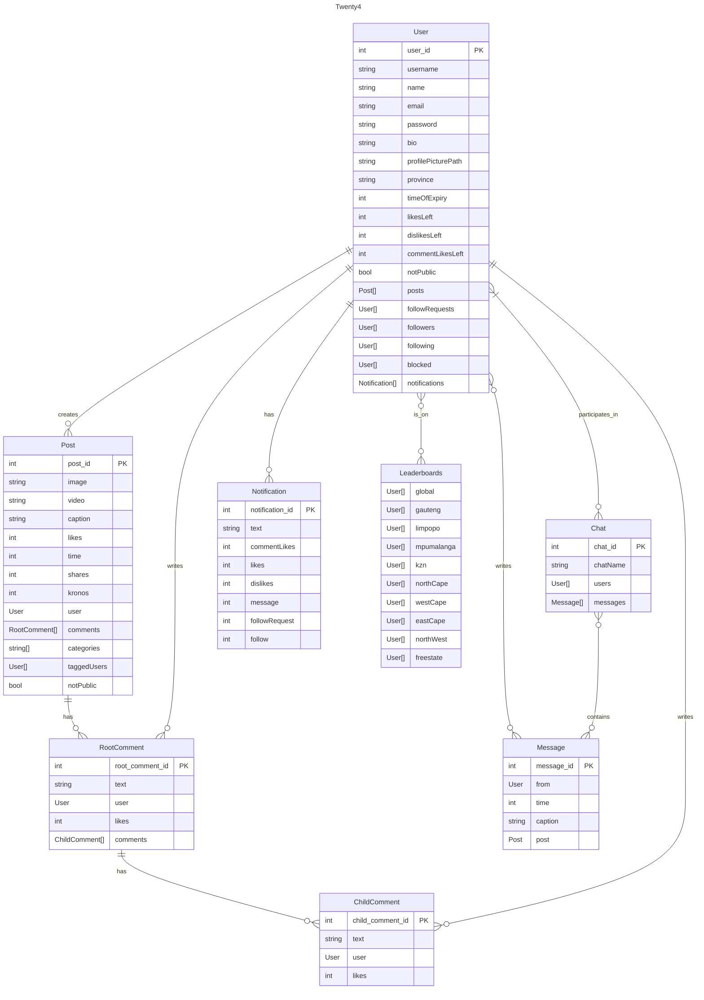

# Blue Skies

## Tables

#### users

- userId (int)
- email (string)
- password (string)
- userRole (int)

```json

"user" : {
    "user_id" : 0,
    "email": "1234567@gmail.com",
    "password": "KjghhKgLKHJgJLkhg9868yb697856f97v690vjhoH9766fh*7", // hashed and salted password
    "bio" : "1",
}

```

#### systems

- systemId (int)
- systemName (string)
- powerRating (int)
- surfaceArea (int)
- cost (int)
- batteryLife (int)

```json

"system" : {
    "systemId" : 1,
    "systemName" : "sun absorber 200",
    "powerRating" : 2000,
    "surfaceAre" : 60,
    "cost" : 300000.00,
    "batteryLife" : 100,
}

```

#### reports

- Content (path to image or video)
- Image (boolean)
- Caption (string)
- Comments (array[RootComment])
- Likes (int)
- Time Posted (int)
- Kronos (int)
- Categories (array["string"])
- Tagged Users (array[User])
- notPublic (boolean)
- Share Count (int)

```json

"post" : {
    "post_id": 1,
    "image": "C:\\path\\to\\image.ext", // Will be either an image or video, therefore
    "video": "C:\\path\\to\\video.ext", // only one of these fields will be displayed.
    "caption": "Caption of the post",
    "likes": 0,
    "time": 1234567890,
    "user": /*User*/,
    "shares" : 0,
    "kronos" : 0,
    "comments": [/*RootComment*/],
    "categories": [/*String*/], // Max 3
    "taggedUsers" : [/*User*/],
    "notPublic": false,
}

```

#### RootComment

- Kronos (int)
- Text (string)
- User (User)
- Likes (int)
- ChildComments (array[ChildComment])

```json

"rootComment" : {
    "root_comment_id": 1,
    "kronos" : 0,
    "text": "Comment",
    "user": /*User*/,
    "likes": 0,
    "comments": [/*ChildComment*/],
}

```

#### ChildComment

- Kronos (int)
- Text (string)
- User (User)
- Likes (int)

```json

"childComment" : {
    "child_comment_id": 1,
    "kronos" : 0,
    "text": "Comment",
    "user": /*User*/,
    "likes": 0,
}
```

#### Direct Messages

```json

"chats" : [
    {
        "chat_id": 3523,
        "chatName": "Name of the Chat";
        "users" : [/*User*/],
        "messages" : [
            {
                "message_id": 235233,
                "from" : /*User*/,
                "time" : 129348768213,
                // caption and post are optional, but at least one is always necessary.
                "caption" : "I love you <3",
                "post" : /*Post*/,
            }
        ],
    }
]

```

#### Local Leaderboard

Top 24. Updated every X hours. The top ten are then saved in the "localLeaderboard" array.

There will exist one for each province and one for the global leaderboard.

```json
"leaderboards" : {
    "gauteng" : [/*User*/],
    "limpopo" : [/*User*/],
    "mpumulanga" : [/*User*/],
    "kzn" : [/*User*/],
    "northWest" : [/*User*/],
    "westCape" : [/*User*/],
    "eastCap" : [/*User*/],
    "northCape" : [/*User*/],
    "freestate" : [/*User*/],
    "global" : [/*User*/],
}
```

#### Example

```json
{
  "users" : [
      {
          "user_id" : 10398140,
          "username": "DieSeeKat",
          "name": "Lukas Anthonissen",
          "email": "lukas007@gmail.com",
          "password": "ynw8yw82n283c2doNdq6T*&nqn",
          "bio" : "live love life",
          "profilePicturePath" : "C:\\images\\gigachad.jpg",
          "province" : "gp",
          "timeOfExpiry": 33235271617,
          "likes": 10,
          "dislikes": 5,
          "commentLikes" : 7,
          "notPublic" : true,
          "posts": [
              69
          ],
          "followers": [8971892],
          "following": [8971892],
          "followRequests": []
      },
      {
          "user_id" : 8971892,
          "username": "RuRu",
          "name": "Ruan Rossouw",
          "email": "ruanRos@gmail.com",
          "password": "ynw8yw82n283c2doNdq6T*&nqn",
          "bio" : "UP student",
          "profilePicturePath" : "C:\\images\\superchad.pdf",
          "province" : "gp",
          "timeOfExpiry": 1678362817,
          "likes": 6,
          "dislikes": 10,
          "commentLikes" : 2,
          "notPublic" : true,
          "posts": [],
          "followers": [10398140],
          "following": [10398140],
          "followRequests": []
      }
  ],

  "posts": [
      {
          "post_id": 69,
          "image": "C:\\images\\dodgeCoinMeme.jpg",
          "caption": "Crypto go brrrrrr",
          "likes": 10731827,
          "shares" : 1,
          "user" : 10398140,
          "time" : 2938729834,
          "comments": [
              {
                  "root_comment_id" : 3424,
                  "text": "so funny ROFLMAOCOL",
                  "user": 8971892,
                  "likes": 234,
                  "comments": [
                      {
                          "child_comment_id": 879853,
                          "text": "ik right?",
                          "user": 10398140,
                          "likes": 12
                      }
                  ]
              }
          ],
          "categories": ["memes","crypto"],
          "taggedUsers" : [8971892],
          "notPublic": true
          }
  ]

  "chats" : [
      {
          "chat_id":235232,
          "chatName": "Demons",
          "users" : [10398140, 8971892],
          "messages" : [
              {
                  "message_id" : 24987,
                  "from" : 10398140,
                  "time" : 129348768213,
                  "caption" : "I'm going to play LoL at 8, wanna join?"
              },
              {
                  "message_id" : 24988,
                  "from" : 8971892,
                  "time" : 129348234233,
                  "caption" : "Sure! I'll probably hop on at about half 9"
              },
              {
                  "message_id" : 24989,
                  "from" : 8971892,
                  "time" : 129348233523,
                  "post" : 69
              },
              {
                  "message_id" : 24990,
                  "from" : 8971892,
                  "time" : 129348238974,
                  "caption" : "BTW this post is hillarious!!!"
              },
              {
                  "message_id" : 24991,
                  "from" : 10398140,
                  "time" : 129348664871,
                  "caption" : "sus"
              }
          ]
      }
  ],

  "leaderboards" : {
      "global" : [10398140, 8971892],
      "gauteng" : [10398140, 8971892],
      "limpopo" : [],
      "mpumalanga" : [],
      "kzn" : [],
      "northWest" : [],
      "westCape" : [],
      "eastCap" : [],
      "northCape" : [],
      "freestate" : []
  }
}

```

# UML Diagram

<div align="center">



</div>
